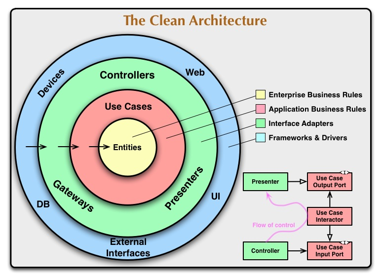

# geonames-api

## Arquitecture

Clean architecture is a software design philosophy that separates the elements of a design into ring levels. An important goal of clean architecture is to provide developers with a way to organize code in such a way that it encapsulates the business logic but keeps it separate from the delivery mechanism.

Clean architecture was created by Robert C. Martin and promoted on his blog, Uncle Bob. Like other software design philosophies, clean architecture attempts to provide a cost-effective methodology that makes it easier to develop quality code that will perform better, is easier to change and has fewer dependencies.

## Installation

pip install docker-compose

docker-compose -f docker-compose/docker-compose.yaml  up

## Swagger Documentation

http://0.0.0.0/docs

### APIs 

Health check
http://0.0.0.0:5000/api/v1/health/

Checking user city and save data
http://0.0.0.0:5000/api/v1/city/